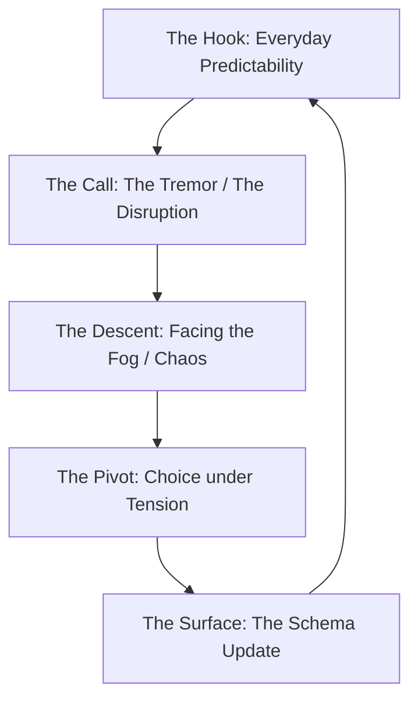

# Crafting Compelling Narratives for Learning in the Age of AI

## Introduction: The Power of Story in Shaping Understanding

### Why Narrative Design & Learning Matter More Than Ever (Today's World & AI)

We tend to think of learning as a clean, predictable line. A straight highway on a map. You start at point A, you memorize a list of facts, you complete the required modules, and you arrive at point B with a certificate in your hand and a tiny dose of satisfaction in your chest. 

But let’s be honest with ourselves: most of what we call learning today feels less like a journey and more like an undefined, anxiety-inducing stretch of time in a doctor's waiting room. 

You know the feeling. You walk in, the air smells vaguely of antiseptic, and a polite voice behind glass says, *"Please take a seat and we will call your name."* 

And then... nothing. 

Immediately, your brain starts to spin. *How much time are we talking about here? Ten minutes? Three hours? Can I step out to get a coffee, or will they call my name the second I close the door?* 

The wait itself isn’t what breaks you. It’s the uncertainty. It's the total lack of context. Without a frame of reference, time stretches out like a blank, foggy road. We aren’t impatient because we are lazy; we are impatient because we have a basic, biological need for certainty. We need to know where we stand in the story.

Yet, we treat learners in the modern world exactly like patients in that waiting room. We dump them into courses and corporate training programs, hand them bulleted lists of raw data, and expect them to sit quietly until we call their name. We treat information as isolated vibrations in the dirt. 

In the age of AI, this approach isn't just outdated; it's a fast track to irrelevance. 

We are drowning in a sea of instantly generated content. If learning is just about retrieving facts, the machine has already won. It can spit out a thousand manuals on toaster repair before you can finish reading this sentence. But raw information is not understanding. Without context—without a narrative—information is just noise. 

Just as a mole needs to understand the vibrations of the earth to navigate its dark world, humans need context (narrative) to navigate information overload and effectively communicate with AI. Narrative design is the map. It is the framework that turns random vibrations into a meaningful journey. It is what connects the signal to the heart, transforming a dry waiting room into an adventure.

---

### Our Philosophy: Unlocking Human Potential Through Engaging Experiences

Here is the truth about the human brain: it is not a hard drive. You cannot simply drag and drop files into a folder and expect them to stay there. 

Have you ever opened your bedroom closet at midnight, looking for a dry shirt, only to find it so packed with old clothes, forgotten clutter, and unused gear that you can’t even slide a hanger? It’s crowded in there. There is no room to breathe, let alone put something new. 

That is what traditional, didactic education does. It treats the mind like a crowded closet, stuffing it with rules, definitions, and frameworks until there’s no space left for curiosity. 

Our philosophy is built on a different premise: true learning is an encounter. It’s not about storage; it’s about discovery. 

Imagine a mole living beneath the surface of the earth. For its entire life, it moves through the predictable, dark soil, reacting only to vibrations. Tight spaces mean safety; tremors mean threat. It’s a content life, in a way. Quiet. Predictable. Safe. The mole doesn't know it's missing anything because it has no map for what lies above.

But then, one day, it pokes its head above ground. 

Suddenly, there is light. Colors. Shapes. Space. A world of infinity. The mole doesn't have the vocabulary to name what it’s sensing, but a new kind of hunger is born: curiosity. Not the kind that seeks, but the kind that liberates. 

We believe that learning experiences should be the "surface" for our learners. We want to design environments that pull people out of their comfortable, predictable tunnels and show them the light. We want to replace the crowded closet of dry information with the wide-open sky of curiosity.

---

### How This Guide Will Transform Your Approach

This guide is not a collection of academic theories or dry templates. (We have enough of those, and frankly, they are exhausting.) 

Instead, this guide is a conversational roadmap. It is designed to help you shift your perspective from a content *delivery* mindset to an experience *design* mindset. By the time you reach the end of this document, you will understand:

*   **The Scientific Engine:** How to leverage the neurobiology of stories and Cognitive Load Theory to design learning that sticks.
*   **The AI Collaboration:** How to use narrative context to co-create with AI, guiding the machine to produce outcomes that align with human purpose.
*   **The Algorithm of Engagement:** A repeatable, step-by-step methodology for structuring learning experiences.
*   **The Creative Economy Model:** How to package this narrative philosophy into profitable courses, workshops, and social media content.

Let’s stop building waiting rooms. Let’s start building horizons.

---

## Part 1: Foundations – The Art & Science of Narrative Learning

### Defining Narrative Design & Learning: A Broad Perspective

What is narrative design? 

If you ask ten different people, you'll get ten different answers. A screenwriter will talk about character arcs. A game designer will talk about branching dialogue trees. An educator might talk about case studies. 

But if we strip away the industry jargon, narrative design is simply **the architecture of presence**. 

Think of two street lamps standing on a foggy night. They don't touch. They don't speak. Yet, there is a presence between them. They light up the empty space around them, casting a warm, soft glow that makes you feel both at ease and inspired. You are drawn to that light, walking toward it without even realizing why. 

Narrative design is that glow. It is the art of creating a presence within a learning environment—an invisible, magnetic energy that draws the learner in and makes them stand a little taller, speak with more confidence, and smile without a second thought. It is the connective tissue between the raw content and the human experience.

Learning, then, is not the act of memorizing the location of the street lamps. It is the act of walking through the fog, feeling the light, and discovering what lies in the spaces between them. It is the transformation that happens to the traveler along the way.

---

### Beyond the Classroom: Where Stories Live and Grow

We have spent decades locking learning inside classrooms. We put desks in rows, drew lines on chalkboards, and told students to sit still. We built maps with sharp, precise boundaries. 

But stories don’t like walls. They are wild things. 

Stories live in the way we order coffee. They live in the way we navigate a new city when we are hopelessly lost. They live in the small, seemingly insignificant decisions we make every day. 

If you design learning only for the classroom, you are building maps for islands that nobody visits. We must look at where stories actually live and grow—in the workplace, on social media, during casual conversations, and in the quiet moments of reflection before sleep. 

When you realize that every human interaction is a narrative, the whole world becomes your canvas. You stop designing "lessons" and start designing "worlds."

---

### The Why: Cognitive Science and Emotional Engagement as Drivers of Learning

Why does narrative design work? Is it just a warm, fuzzy concept, or is there science behind it? 

Let's look at the brain chemistry. Dr. Paul Zak, a neuroscientist who has spent decades studying the biology of trust and empathy, discovered that when we engage with a story that has a strong dramatic arc, our brains release a specific cocktail of chemicals:

1.  **Cortisol:** Triggered by tension, crisis, and conflict. Cortisol focuses our attention, signaling that something important is changing and requires our immediate focus.
2.  **Dopamine:** Triggered as a reward for curiosity and prediction. As the story moves forward, dopamine keeps us seeking answers, while the final resolution of the climax triggers a final dopamine reward loop that encodes the entire experience into long-term memory.
3.  **Oxytocin (The "Moral Molecule"):** Triggered by character empathy and shared connection. Oxytocin dampens amygdala activity, reducing social fear, skepticism, and distrust, thereby opening us up to new perspectives.

Dr. Zak's research shows that combining **Attention (Cortisol)** and **Connection (Oxytocin)** calculates what he calls the **Immersion Index**—the brain's ultimate **"give a shit" measure**. When these chemicals spike together, the brain transitions from passive observation to active learning.

```
Tension (Freytag's Arc) ──> Cortisol (Attention) & Dopamine (Curiosity)
                                       │
                                       ▼
Character Empathy       ──> Oxytocin Release (Dampened Amygdala/Trust)
                                       │
                                       ▼
                         THE "GIVE A SHIT" MEASURE
                      (Immersion Index & Memory Encoding)
```

Furthermore, this aligns perfectly with **Cognitive Load Theory (CLT)**, developed by John Sweller. CLT states that our working memory has a strictly limited capacity—it can only hold about 5 to 9 "chunks" of information at a time. When we overwhelm this limit, learning stalls (cognitive overload). 

However, long-term memory is virtually unlimited, storing information in structured mental frameworks called **schemas**. 

Storytelling acts as a powerful cognitive scaffold that reduces extraneous cognitive load. By organizing content into a logical, sequential narrative arc, we group complex ideas into a single, cohesive "chunk" (a story). This frees up the brain's resources for **germane load**—the mental effort specifically directed toward constructing and automating new schemas. 

In short: if you want a learner to remember, you don't build a bigger bucket; you package the information in a story so it slots directly into their existing mental schemas.

---

### The Theoretical Tapestry: Key Pedagogical & Design Principles

To build effective learning narratives, we need to understand the structural rules that keep the story from collapsing. Let’s look at the classic pedagogical frameworks, but view them through a human lens:

| Pedagogical Principle | Traditional View | Narrative View |
| :--- | :--- | :--- |
| **Experiential Learning (Kolb)** | Concrete experience, reflective observation, abstract conceptualization, active experimentation. | Entering the space of tension, making a choice, feeling the consequences, and updating the internal map. |
| **Constructivism (Vygotsky)** | Building new knowledge on top of existing foundations through social interaction. | Collaborative meaning-making, where learners share their personal perspectives to solve a narrative crisis. |
| **Zone of Proximal Development** | The sweet spot between what a learner can do alone and what they can do with help. | Poking your head out of the molehill—just enough light to see, not enough to blind you. |

But here is the danger: we can get so caught up in the rules, the grids, and the coordinates that we end up like the tragic figure of the cartographer. 

Imagine a cartographer who prides himself on absolute order. His home is spotless. Every map is precise. If a villager loses a ring or a toy, he asks, smugly: *"Where did you last see it? When did you last see it?"* 

He believes that if everything has a place, nothing can ever be lost. 

But then, one morning, he wakes up to find a blank spot in the middle of his own map. An unnamed region of his inner world has vanished. No amount of measuring or drawing can fill it. 

This is the **Cartographer’s Curse**: maps are only useful if you know what you are looking for. If we make our learning designs too rigid, too perfect, we leave no room for the blank spots. We forget that the most meaningful discoveries happen when we are slightly lost. We must leave space for the learner to wander, to make mistakes, and to find their own way back.

---

### From Ancient Oral Traditions to Modern Digital Experiences: Tracing the Arc of Learning

We have been doing this for a long time. 

Before there were books, before there were screens, there was the fire. We sat in circles, looking at the sparks rise into the dark sky, listening to stories of hunts, transitions, and ancestors. That was our first classroom. 

Then came the printing press, and we flattened the stories. We put them in neat rows of black ink. 

Then came the digital age, and we made the stories hyper-connected, fast, and fragmented. 

Today, we stand at the edge of a new frontier. The arc of learning has traveled from the campfire to the classroom, then to the computer screen, and now, into the conversational space of artificial intelligence. We are returning to our roots. Learning is becoming conversational, interactive, and personal once again. We are sitting around a digital campfire, and the AI is helping us spark the flames.

---

### Deep Dive: Philosophical Underpinnings of Story-Driven Education

At its deepest level, narrative learning is an existential act. 

We do not tell stories just to pass the time; we tell stories to survive. We live in a world that is chaotic, random, and often indifferent. Stories are the shields we build against the absurdity of existence. They are how we make sense of suffering, joy, waiting, and change.

When we design a learning experience, we are offering the learner a way to organize their inner world. We are helping them write the script of who they are and who they want to become. It is a sacred task. If we treat it as merely "content delivery," we are missing the point entirely. We are handing them dry biscuits when they are starving for meaning.

---

### Narrative Design in the AI Era: Collaborating with Our New Co-Creators

Let’s talk about the giant, shiny elephant in the room: AI. 

Some people look at AI and see a threat—a cold, automated monster that will replace human writers, teachers, and creators. They see a machine that can churn out essays, lesson plans, and code in seconds, leaving us obsolete.

But they are looking at the machine the wrong way. 

AI is not the shipwright; it is the lumber. It is a massive, incredibly power-packed pile of raw material. But it has no direction. It doesn't know *why* it is building a ship. It doesn't know where the ship is going, or what it feels like to face a storm at sea. 

That is where we come in. 

We are the curators. We are the decision-makers. The AI can generate the coordinates, but only we can decide if the island is worth visiting. The relationship between human and AI is not one of replacement, but of co-creation. The machine gives us speed; we give it soul.

---

### Communicating with AI: The Art of Prompting as Contextual Narrative

How do we talk to this machine? 

Many people treat prompting like writing code. They use keywords, strict parameters, and rigid templates. They write prompts like: *"Write a 500-word article about narrative design using active verbs."* 

And then they wonder why the output feels like a cardboard cutout—dry, generic, and lifeless. 

To get a soul out of the machine, you must feed it a soul. You must understand that prompting is the art of **contextual narrative**. 

Just as the mole needs to understand the vibrations of the earth to navigate its dark world, the AI needs to understand the emotional and philosophical context of your request to navigate its vast database of human knowledge. 

When you write a prompt, you are not writing instructions; you are setting a stage. This is why techniques like **Persona Prompting** and **Scenario Prompting** are so effective. 

*   **Persona Prompting:** You anchor the model's response style and domain knowledge by assigning it an identity (e.g., *"Act as a seasoned learning experience designer who prefers simple, metaphorical language."*)
*   **Scenario Prompting:** You place the LLM within a specific context, providing boundaries and temporal constraints (e.g., *"Imagine we are designing a workshop for corporate leaders who are highly skeptical of change..."*)

More importantly, research in prompt engineering has highlighted a pattern called **Narrative-of-Thought (NoT)**. Instructing the AI to outline a narrative sequence or recount events step-by-step *before* arriving at a solution dramatically improves its logical and temporal reasoning. By forcing the AI to "tell the story" of the problem, we help it generate highly accurate, aligned, and human-like outputs.

---

### Shaping AI's Output: Human Decision-Making and Curation in a Co-Creative Process

The machine will give you options. Lots of them. It will spit out ten different outlines, fifty different headlines, and a hundred paragraphs of text. 

And this is where most creators fail: they accept the first thing the machine hands them, or they get overwhelmed by the sheer volume of choices and shut down. 

Curation is the ultimate modern skill. 

It is the act of looking at the pile of raw output and finding the one line that has a heartbeat. It is about editing, refining, and injecting your own personal experiences, quirks, and vulnerabilities into the text. 

If the AI writes a beautiful paragraph about waiting, you must be the one to add: *"Yeah, like that damn waiting room at the clinic where they never tell you how long it’s going to take."* 

The human touch is not something we add at the end; it is the filter through which every piece of AI output must pass. We are the curators of meaning.

---

## Part 2: Methodology – Designing Immersive Learning Journeys

### Core Methodologies & Frameworks for Narrative Learning

How do we translate this philosophy into a repeatable design process? We start with the classic narrative structures, but we adapt them for the learner’s journey:



1.  **The Hook (Status Quo):** We start in the predictable tunnel. Everything is safe, quiet, and a little boring.
2.  **The Tremor (The Disruption):** A new root breaks through the ceiling. A question is asked. The old rules no longer work.
3.  **The Descent (The Fog):** The learner enters the space of uncertainty. They don't have all the answers. They must search.
4.  **The Pivot (The Choice):** The learner must make a decision under tension. This is where the learning happens.
5.  **The Surface (Integration):** The learner emerges with a new perspective, ready to update their internal map.

---

### Structuring Stories for Maximum Impact

Pacing is everything. 

If you give the learner too much tension too early, they will panic and jump off the bus. If you give them no tension at all, they will fall asleep. You must design a learning arc that balances challenge with support.

Think of a good story. It has peaks and valleys. It has quiet moments of reflection followed by sudden rushes of adrenaline. Your learning designs should do the same:

*   **Introduce a mystery:** Don’t explain the framework first. Show the broken system and ask them to figure out why it failed.
*   **Vary the scale:** Alternating between high-stakes decisions and quiet, personal journals.
*   **Build the climax:** The final challenge where they must apply everything they have learned under pressure.

---

### Integrating Interactive Elements: Making Learners Active Story Participants

Let's look at a mother walking through a small town with her five-year-old son. 

As they walk, the child looks around and starts asking simple, disruptive questions:
*   *"Mom, why did they put the trash can on the sidewalk where there could be a drinking fountain?"*
*   *"Why didn't the patisserie put a display table outside so everyone can smell the cookies?"*
*   *"Why do the park benches face the playground? Isn't it better if children play freely without being stared at?"*

To each question, the mother replies: *"I don't know, maybe yours is a better idea."* 

And here is the magic: the town hears him. The trash can is moved. The drinking fountain is built. The patisserie puts out a table, filling the street with the scent of fresh cookies. The benches are turned around, freeing the children from surveillance. 

This is the power of active participation. 

Most learning designs are like the old park benches—facing the learners, staring at them, keeping them under surveillance. We tell them what to think, where to look, and how to behave. 

Instead, we must design environments that listen. We must build learning experiences where the learner's choices actually change the landscape. If a learner makes a decision, the story should bend. If they suggest a better idea, the system should adapt. When learners realize their voice has power, they stop being spectators and become authors of the experience.

---

### The Algorithm of Engagement: Connecting Philosophy to Practical Application

Engagement is not a mystery. It is a process that can be mapped, refined, and repeated. We call this the **Algorithm of Engagement**:

```
[Attention: Cortisol & Dopamine] ──> [Connection: Oxytocin] ──> [Pivot: Schema Update] ──> [Resolution: Dopamine Reward]
```

1.  **The Attention Hook (Cortisol & Dopamine Trigger):** Start by introducing an unexpected anomaly, crisis, or conflict. Do not present the solution; present the disruption to trigger **Cortisol** (for narrow attention) and **Dopamine** (for curiosity).
2.  **The Emotional Connection (Oxytocin Release):** Introduce human stakes, empathy, or vulnerability. Make the struggle relatable, triggering **Oxytocin** by reducing social defense and skepticism in the amygdala.
3.  **The Cognitive Pivot (Schema Update):** Present a choice with complex trade-offs. The learner must actively process the options, forcing their working memory to reorganize information and build new mental schemas.
4.  **The Climax & Resolution (Dopamine Reward Loop):** Resolve the structural tension. The resolution triggers a final **Dopamine** release, acting as a neurochemical reward that signals the brain to encode the entire schema update into long-term memory.

---

### How to Choose Your Narrative Approach: Aligning Vision with Method

Not every subject needs a full-blown fantasy epic. You must match your narrative wrapper to your learning goals:

*   **The Case Study (Low Drama, High Realism):** Best for technical skills, compliance, or finance. Focus on realistic scenarios with complex trade-offs.
*   **The Mystery (Medium Drama, High Curiosity):** Best for troubleshooting, coding, or diagnostics. Start with a broken system and let the learner gather clues.
*   **The Journey (High Drama, Medium Realism):** Best for leadership development, mindset shifts, or onboarding. Focus on personal transformation, choices, and character growth.

---

### Practical Steps for Crafting Compelling Learning Narratives

1.  **Find the Core Tension:** What is the central conflict of the topic? (e.g., in a compliance course, the tension is between speed and safety.)
2.  **Create the Protagonist:** Give the learner an avatar or a character to empathize with. Make them human, flawed, and recognizable.
3.  **Draft the Branching Paths:** Map out the choices. Ensure that even the incorrect choices lead to interesting narrative feedback, not just a red *"Try Again"* screen.
4.  **Write the Dialogue:** Keep it conversational. Read it out loud. If it sounds like something a robot would say, throw it out.
5.  **Inject the Micro-Animations:** Add small, visual, or textual details that make the world feel alive. A smirk, a wet shirt, a cozy smile.

---

## Part 3: Application & Innovation – Workshop Tooltips & Future Horizons

### Designing Transformative Workshops: Practical Tooltips for Facilitators

A workshop should never feel like a forced bus ride where you sweat because you don't have a ticket. It should feel like a shared adventure. Here is how to design and facilitate a narrative-driven workshop:

#### Concept Development
Start with the "Why." What is the one shift in perspective you want your participants to experience? Write it down in one sentence. This is your North Star. Every activity, every story, and every slide must serve this single goal. If it doesn't, cut it.

#### Narrative Structure
Map out the flow of the day using a dramatic arc. 

*   **The Arrival (0-30 mins):** Break the ice by addressing the elephant in the room. Acknowledge their time and their skepticism. Set a cozy, welcoming tone.
*   **The Disruption (30-90 mins):** Introduce the core challenge. Present a scenario where their current tools fail.
*   **The Struggle (90-180 mins):** Group activities where they must collaborate, search, and design solutions.
*   **The Reveal (180-240 mins):** Groups present their designs and receive real-world, constructive feedback.
*   **The Integration (Last 30 mins):** Quiet, individual reflection on what they will do differently tomorrow.

#### Engaging Activities
Don't use generic icebreakers. Design story-driven tasks. Instead of asking people to introduce themselves, ask them to share a story about a time they got lost and what they discovered. Instead of a standard brainstorming session, run a "pre-mortem" where they must write the story of how their project catastrophically failed and why.

#### Facilitator Notes: Guiding Principles for Dynamic Storytellers
When you facilitate, do not try to be the all-knowing guru. 

Instead, seek to embody **Nigel**. 

Nigel is warm, quirky, and slightly unpredictable. He tells jokes that sometimes fall flat, but he has a cozy smile and a way about him that makes everyone feel safe. He isn't perfect, and he doesn't pretend to be. He adds a unique, enjoyable flavor to the room. 

As a facilitator, your job is not to deliver information; your job is to hold the space. Be conversational. Admit your own mistakes. Encourage the quiet voices. Make the room feel bright, safe, and open to the unexpected.

---

### Beyond the Workshop: Scaling Narrative Learning

#### Digital Platforms & Blended Learning Environments: Expanding Reach

How do we take the magic of a live, story-driven workshop and scale it for thousands of digital learners? 

We do it by building digital environments that feel like worlds, not filing cabinets. Stop organizing your Learning Management System (LMS) by files and folders. Instead, build a path. 

Use visual maps, interactive journals, and narrative check-ins. Allow learners to leave comments, share their "unusual ideas," and see how their peers solved the same problems. Make the digital space feel populated, warm, and alive.

#### Leveraging AI to Automate & Personalize Narrative Experiences: The Future of Learning

The future of learning is dynamic. 

Imagine a course where the story adapts to your decisions in real time. You log in, make a choice, and the AI generates the next chapter of the scenario specifically for you, tailored to your strengths and weaknesses. 

We can use AI to build conversational coaches, roleplay partners, and interactive narrative systems that provide personalized feedback at scale. The learner is no longer clicking through a slide deck; they are having a dialogue with an evolving story.

---

### Monetization & Impact: Turning Narratives into Tangible Value

#### Crafting Engaging Social Media Narratives

If you want to build an audience, stop posting advice. Start posting encounters. 

In the creator economy, people don't share bullet points; they share moments of realization. Turn your design insights into short, punchy stories on LinkedIn, Twitter, or your newsletter. 

*   *Instead of:* *"3 ways to improve your prompting."*
*   *Write:* *"I spent three hours yesterday trying to explain a complex design problem to a machine. I failed, got frustrated, went to make coffee, and realized I was talking to it like a coder, not a creator. Here’s what happened when I changed my approach..."*

Make your audience feel the tension, the struggle, and the realization. That is how you turn followers into believers.

#### Developing Impactful Courses & Programs: The Cohort-Based Model (Maven)

Once you have built an audience, you can package this narrative methodology into premium courses, cohorts, and advisory programs. 

In the modern education market, the value has shifted. Because information is free, self-paced courses (MOOCs) suffer from abysmal completion rates (typically **5% to 15%**). Learners are tired of passive content. 

This is why **Cohort-Based Courses (CBCs)** hosted on platforms like **Maven** are booming. By centering your course on:

1.  **Transformation over Information:** Focus on the students producing a tangible project (e.g., their own narrative curriculum).
2.  **Community-as-Curriculum:** Use live, interactive peer reviews and group challenges.
3.  **Accountability:** Moving through the journey together on a fixed timeline.

Cohort-based programs routinely achieve completion rates of **85%+** and can be priced at a premium ($500 - $2,000+ per student). By teaching others how to design narrative-driven experiences, you aren't selling content; you are selling the one thing the machine cannot replicate: human connection, transformation, and perspective.

---

## Conclusion: Your SUPER! Journey Continues

### Key Takeaways & Immediate Next Steps

We have covered a lot of ground. We’ve looked at the waiting room of uncertainty, the neurochemistry of dr. Zak's stories, the mole emerging into the sun, the cartographer’s blank spots, and the cohort-based economics of Maven. 

If you remember nothing else from this guide, remember this:

1.  **Context is King:** In the age of AI, information is cheap. Meaning is priceless. Build narratives, not databases.
2.  **AI needs your context:** The machine is the wood; you are the shipwright. Use Persona, Scenario, and Narrative-of-Thought prompting to guide its power.
3.  **Reduce working memory load:** Use narrative sequencing to package complex ideas into cohesive schemas.
4.  **Embody Nigel:** Be warm, be human, be a little quirky. Connection is the ultimate driver of learning.

### Invitation to Co-Create Stories (and the future of learning!)

This document is not a finished monument. It is a conversation starter. 

The age of AI is a blank spot on our collective map. We have no pre-drawn lines, no compass rose, and no established coordinates for where this technology will take us. 

And that is the most exciting place to be. 

It is our opportunity to build a new map—one that is human-centric, creative, and deeply engaging. We invite you to join us on this journey. Share your stories, experiment with these methodologies, make your own mistakes, and help us design the future of learning.

The surface is waiting. See you above ground.
